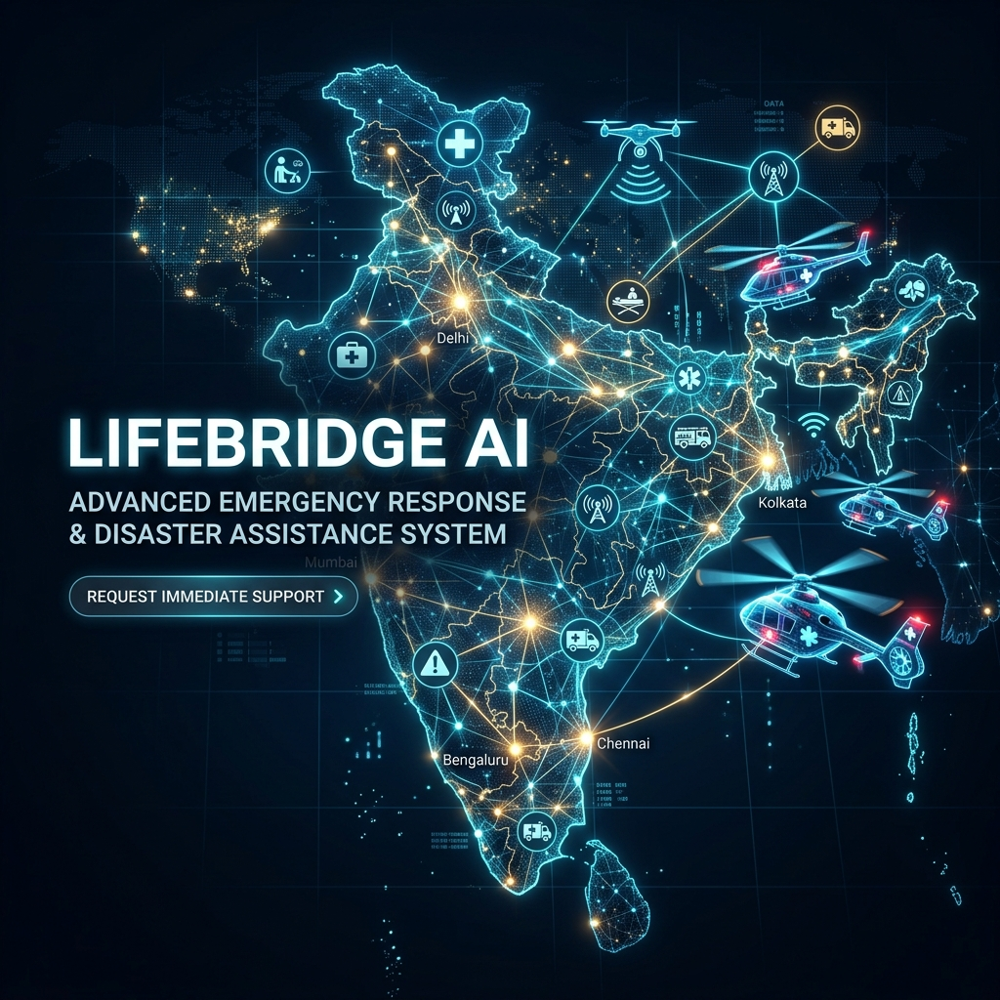
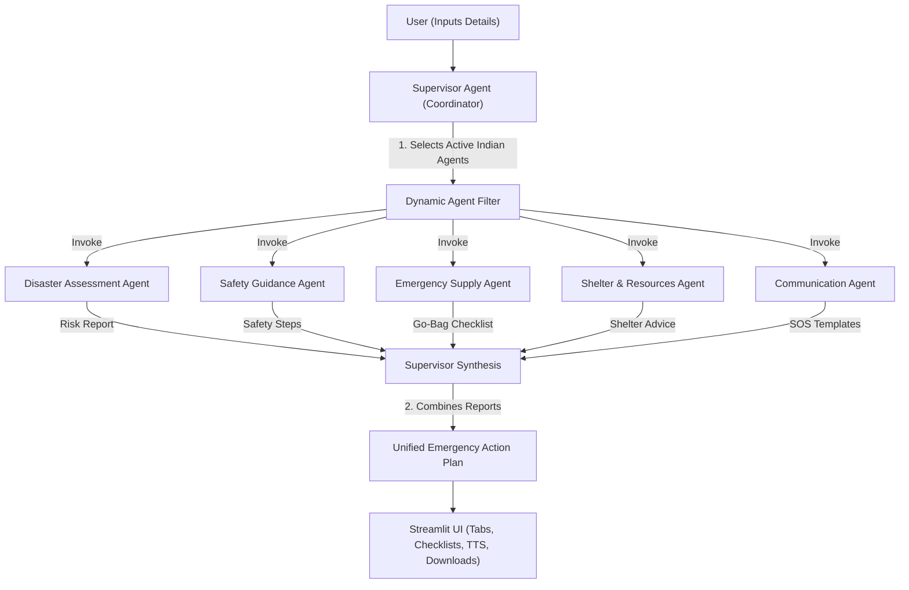

# LifeBridge AI – Emergency Response & Disaster Assistant (Indian Version)

<p align="center">
  
</p>

**Track**: Agents for Good

**LifeBridge AI** is a comprehensive multi-agent emergency response and disaster assistant system powered by the Google Gemini API, localized specifically for the Indian subcontinent. It coordinates five specialized agents under a centralized Supervisor Agent to deliver structured, localized, and context-aware action plans during Indian disaster scenarios (such as monsoon floods, landslides/cloudbursts, cyclones, chemical leaks, and heatwaves).

---

## 🏗️ System Architecture & Workflow

During an emergency, users input their disaster type, location, and situational details. The Supervisor coordinates the workflow in a multi-stage process:



### 🔄 Multi-Agent Workflow Details
1. **User Initiation**: The user inputs details regarding an emergency scenario (e.g., location, severity indicators, and disaster type).
2. **Supervisor Delegation**: The Supervisor Agent interprets the query and filters which specialized sub-agents are needed to resolve the crisis.
3. **Parallel Processing**:
   * **Disaster Assessment Agent** classifies risk parameters (Low, Medium, High, Critical) and notes active primary and secondary hazards.
   * **Safety Guidance Agent** delivers emergency survival instructions and first-aid measures.
   * **Emergency Supply Agent** dynamically builds a survival go-bag checklist suited to the scenario.
   * **Shelter & Resources Agent** finds appropriate shelters (e.g., Panchayat Bhawans, Cyclone Shelters) and catalogs essential documents/utilities to secure.
   * **Communication Agent** generates pre-composed distress templates for SMS/WhatsApp.
4. **Synthesis & Presentation**: The Supervisor Agent collates the output into a single, unified emergency response guide, which is rendered dynamically in the Streamlit user interface.

---

## 🤖 AI Agents Directory (Indianized)

1. **Supervisor Agent**  
   Coordinates the specialized sub-agents and synthesizes raw outputs into a unified, clean, phase-by-phase Emergency Action Plan prioritizing **Indian Public Resources** (112, 1070, 1077, 1078).
2. **Disaster Assessment Agent**  
   Classifies the disaster, assesses the severity level (Low, Medium, High, Critical), and lists active threats or secondary hazards.
3. **Safety Guidance Agent**  
   Provides rapid life-saving instructions, safe evacuation paths/practices, and emergency first-aid advice.
4. **Emergency Supply Agent**  
   Compiles checklists of items categorized by category (Nutrition, Medical, Tools, critical papers), using standard markdown checkmarks for the UI parser.
5. **Shelter & Resources Agent**  
   Identifies appropriate shelter strategies (e.g., multipurpose cyclone shelters, brick/RCC school buildings, Panchayat Bhawans) and lists critical Indian documents (Aadhaar cards, ration cards) and utilities (LPG gas cylinder valves, main electricity meters) to secure.
6. **Communication Agent**  
   Generates copy-paste SMS/WhatsApp templates for family updates and high-priority SOS messages pointing to Indian emergency services (112, 100, 101, 102, 1078).

---

## ⚡ Key Premium Features

* **Indianized Scenario Presets**: Sidebar templates for Mumbai Floods, Himalayan Cloudburst, Cyclone Landfall, Vizag Gas Leak, and Delhi Heatwave.
* **Interactive Supply Checklist**: Check off items interactively in the web app as you package your crisis gear.
* **Offline Resource Exporter**: Exports the entire action plan, lists, and SOS messages to a Markdown/text file for off-grid reading.
* **Accessibility Audio Reader**: Browser-based Text-to-Speech (TTS) voice guide reads key instructions aloud for individuals in low-visibility or injured states.
* **Rapid First-Aid Reference Card**: A rapid-lookup sidebar guide for CPR, severe bleeding, thermal burns, heat stroke, and choking.

---

## 🚀 Setup & Local Execution

### 1. Prerequisites
Make sure you have **Python 3.9 - 3.12** installed on your Windows machine.

### 2. Installation
Clone this repository (or open the project directory) and run:
```powershell
# Create a virtual environment
python -m venv venv

# Activate the virtual environment
.\venv\Scripts\Activate.ps1

# Install required dependencies
python -m pip install -r requirements.txt
```

### 3. Set API Key
Create a `.env` file based on `.env.example` or supply your Gemini API Key directly inside the app sidebar:
```env
GEMINI_API_KEY=your_actual_gemini_api_key
```

### 4. Run the App
Launch the Streamlit dashboard:
```powershell
python -m streamlit run app.py
```
A browser window will open automatically pointing to `https://lifebridge-ai-jyvejvpi7uz5tdxuyrnaon.streamlit.app/`.
